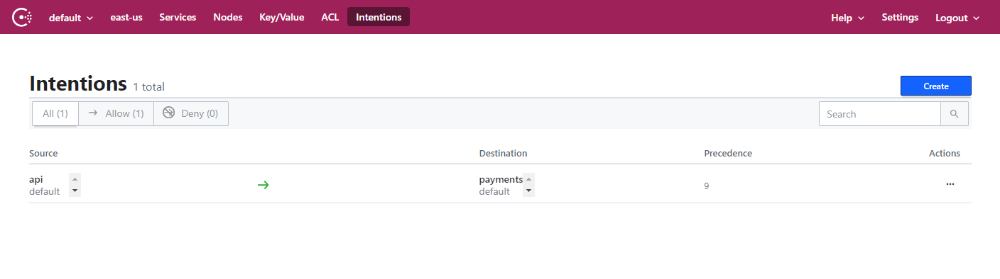

# Demo - HashiCorp Consul Service on Azure
Demo configuration for running an example application with the HashiCorp Consul Service in Azure

## Requirements

* [Terraform 0.12 +](https://releases.hashicorp.com/terraform/)
* [Azure CLI](https://docs.microsoft.com/en-us/cli/azure/install-azure-cli?view=azure-cli-latest)
* Azure CLI HCS Plugin

```shell
az extension add \
  --source https://releases.hashicorp.com/hcs/0.1.0/hcs-0.1.0-py2.py3-none-any.whl
```
* [Azure Service Principal and Secret for Auth](https://www.terraform.io/docs/providers/azurerm/guides/service_principal_client_secret.html)

## Obtain service principal credentials

The examples in this repository requires a valid Service Principal and Secret for your subscription, the following guide will walk you through how to obtain these details.

https://www.terraform.io/docs/providers/azurerm/guides/azure_cli.html#logging-into-the-azure-cli

Once you have your authentication credentials set the following environment variables so that they can be used from the Terraform config.

```shell
# Credentials to create resources in Azure
export ARM_CLIENT_ID="xxxx-xx-x-x-x-x-xxxx-xx"
export ARM_CLIENT_SECRET="xxxx-xxx-xxx-x-x-xxx-xxxx-xxxx"
export ARM_SUBSCRIPTION_ID="xxxx-xxx-xxxx-xxxx-xxxx-xx"
export ARM_TENANT_ID="xxxx-xxx-xxx-x-xx-x-xxx-xxxxx"

export TF_VAR_client_id="${ARM_CLIENT_ID}"
export TF_VAR_client_secret="${ARM_CLIENT_SECRET}"
export TF_VAR_tenant_id="${ARM_TENANT_ID}"

# Terraform Variables
export TF_VAR_ssh_public_key="$(cat $HOME/.ssh/id_rsa.pub)"
export TF_VAR_resource_group="[name for your resource group]"
export TF_VAR_managed_resource_group="mrg-${TF_VAR_resource_group}"
export TF_VAR_accept_marketplace_aggrement="0"
```

## Creating a HCS cluster in Azure [./hcs](./hcs)

### Resources:
* Azure managed application HashiCorp Consul Service, single node
* Azure resource group
* Azure virtual network 
* Virtual network peering between HCS cluster network and virtual network for AKS and VMs

To create a the HCS cluster run `terraform apply`, in the below example the flag --auto-approve is used for convenience, this should not be used in production.

```shell
cd hcs
terraform apply --auto-approve
```

If you receive an error that you have not accepted the market place aggrement for HCS, you can set the following environment variable and rerun the previous command.

```shell
export TF_VAR_accept_marketplace_aggrement="1"
```

The output from the terraform will contain all the required details for connecting to your HCS cluster. You can see this information by using the `terraform output` command.

To view the Consul UI you can use the public_url and authenticate using the acl_token

## Creating a virtual machine and connecting it to HCS

### Resources:
* Public IP address
* Network interface
* Vitural machine
* User assigned identity for virtual machine
* Consul authentication method for JWT (Azure Managed Identity) 

The Terraform code in the folder ./payments creates a virtual machine running a simple application and Consul agent and connect it to the HCS cluster. To authenticate with HCS the VM, the Consul JWT auth method has been configured to allow vms to authenticate using oauth tokens which can be obtained from the Azure metadata service.

```shell
cd payments-vm
terraform apply --auto-approve
```

## Integrating HCS and AKS

### Resources

* Azure Kubernetes Cluster (single node)
* Helm chart to install Consul agents and configure Kubernetes authentication for HCS
* Simple application which securely connects to the application running on the payments virtual machine
* Load balancer pointing at API application

The Terraform code in the folder ./aks sets up and configures an AKS cluster and deploys the Consul Helm chart in agent only mode. Kubernetes authentication is configured in Consul to authorize applications running in Kubernetes pods to obtain a valid service mesh identity. Consul service mesh by default denys traffic between applicaitons, an Intention has been configured which explictly allows traffic to flow between the API application deployed to Kubernetes and the Payments application running on the virtual machine.

```shell
cd aks
terraform apply --auto-approve
```

## Testing the application

With all components configured a full end to end test of application traffic from the API application to the Payments application on the virtual machine can be performed.

### Consul UI

To obtain the public URL and the ACL token necessary to view the Consul UI you can use the following commands.

#### Fetching the Public URL

The HCS configuration has public access for the UI enabled, to fetch the URL for the UI use the following command:

```shell
cd hcs
terraform output --json hcs_config | jq -r .public_url
➜ terraform output --json hcs_config | jq -r .acl_token
```

You should see a URL returned in your terminal similar to the one below, use this URL in your web browser to open the UI

```shell
https://11ead278-e8c6-c75c-b060-0242ac11000c.consul.az.hashicorp.cloud
```

#### Getting the Consul ACL token

Once you have the UI open in your browser you need to authenticate, authentication can be done with the bootstrap ACL token. To obtain this token use the following commands.

```shell
cd hcs
terraform output --json hcs_config | jq -r .acl_token
```

You should see a token like the following example output to the command line:

```shell
1fa1c7c2-d7cc-788a-4fd7-f141186283a0
```

Enter this token in the Login box to view the Consul UI


If everything is working you will see the Consul UI with three services listed.


### Testing the application

To test the application first get the IP address for the external loadbalancer:

```shell
terraform output lb_ip 
```

You will see an ip address returned which looks something like the following:

```shell
52.255.221.155
```

If you use cURL to make a request to the endpoint a response containing JSON will be returned. The API service in Kubernetes makes an upstream call to the Payments service which is running on the VM. This is not a direct point to point connection but routed through Consul service mesh.

```shell
➜ curl 52.255.221.155
{
  "name": "API",
  "uri": "/",
  "type": "HTTP",
  "ip_addresses": [
    "10.2.0.22"
  ],
  "start_time": "2020-07-31T06:19:50.201508",
  "end_time": "2020-07-31T06:19:50.289097",
  "duration": "87.589019ms",
  "body": "Hello World",
  "upstream_calls": [
    {
      "name": "Payments-VM",
      "uri": "http://localhost:9091",
      "type": "HTTP",
      "ip_addresses": [
        "10.2.0.4"
      ],
      "start_time": "2020-07-31T06:19:50.287087",
      "end_time": "2020-07-31T06:19:50.287404",
      "duration": "316.7µs",
      "headers": {
        "Content-Length": "259",
        "Content-Type": "text/plain; charset=utf-8",
        "Date": "Fri, 31 Jul 2020 06:19:50 GMT"
      },
      "body": "Hello from API",
      "code": 200
    }
  ],
  "code": 200
}
```

Intentions in Consul are the rules which allow or deny this service to service communication. The AKS module automatically configures an intention which allows traffic from the API to the Payments service.



If you modify the existing Intention currently configured, and change the permission to Deny


When you curl the endpoint again, you will see that the communication to the Payments service is no longer allowed and the upstream call results in an error

```shell
➜ curl 52.255.221.155
{
  "name": "API",
  "uri": "/",
  "type": "HTTP",
  "ip_addresses": [
    "10.2.0.22"
  ],
  "start_time": "2020-07-31T06:30:47.930028",
  "end_time": "2020-07-31T06:30:47.950009",
  "duration": "19.980678ms",
  "body": "Hello World",
  "upstream_calls": [
    {
      "uri": "http://localhost:9091",
      "code": -1,
      "error": "Error communicating with upstream service: Get http://localhost:9091/: EOF"
    }
  ],
  "code": 500
}
```